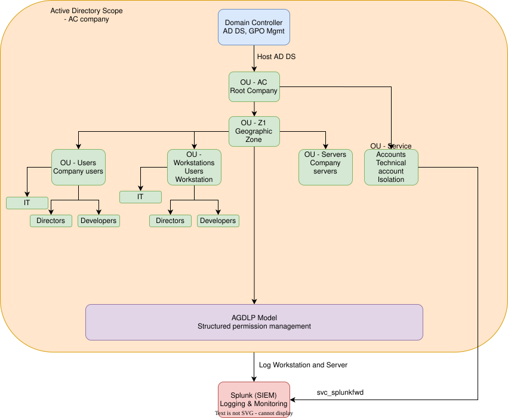

# Infrastructure Security Assessment - Active Directory Hardening (AC Company)

## 🎯 Objective

Design and implementation of an Active Directory structure which follows the Microsoft best practices for the `AC-SRV-EU-IT.local` domain (Z1 Geographic Zone), applying the least privilege principle, centralized policy management through GPO, monitoring security events through Splunk and semplification of the onboarding workstation through pre-staging phase.

## 🛠️ Tools and Methodology

- **Domain**: AC-SRV-EU-IT.local (Z1 Zone)
- **Tools**: Active Directory Domain Services, Group Policy Management, Splunk Enterprise + Universal Forwarder, PowerShell
- **Reference Framework**: AGDLP model, Least Privilege principle

## 🏗️ Infrastructure Architecture



**Implemented OU structure:**

| OU | Content | Scope |
|----|-----------|-------|
| OU=AC | Company Root | Main container for all the principal enterprise objects |
| OU=Z1 | Geographic Zone | Separation for future expansion (Z2, Z3...) |
| OU=Users\IT / Directors / Developers | Users by department | Differentiated administrative policies |
| OU=Workstations\IT / Directors / Developers | PC per department | Differentiated Policy workstation |
| OU=Servers | Enterprise Servers | Server specific policies |
| OU=ServiceAccounts | Technical Accounts | Service account isolation (e.g., Splunk) |

## 🔐 AGDLP Model and Security Groups

**Global Groups** (group users per department):
- `GG_IT` — workstation administrative rights, RDP access to DC
- `GG_Directors` — access to Management confidential folder
- `GG_Developers` — access to Develop confidential folder

**Domain Local Groups** (directly assigned to NTFS permissions):
- `DL_DirectorsFolder_RW` → `\\AC-SRV-EU-IT-Z1\Directors` (Modify)
- `DL_DevelopersFolder_RW` → `\\AC-SRV-EU-IT-Z1\Developers` (Modify)

The **AGDLP** flow (`GG_Directors → DL_DirectorsFolder_RW → Permission`) avoid to assign permissions to individual users, reducing the risk of privilege creep over time.

## 🛡️ Least Privilege Service Account

`svc_splunkfwd` execute the Splunk Universal Forwarder process, without administrative privileges, exclusive member of **Event Log Readers** local group (for the read-only access to security logs), configured through dedicated GPO (`GPO_SplunkForwarder_ServiceAccount`).

## ⚙️ Main Group Policy Objects 

| GPO | Function |
|-----|----------|
| `GPO_IT_LocalAdminRights` | Add GG_IT as local administrator on all the workstations |
| `GPO_Directors_Restrictions` | Block Control Panel and Microsoft Edge for directors |
| `GPO_Directors_DriveMapping` / `GPO_Developers_DriveMapping` | Automatic mapping of shared drives |
| `GPO_SplunkForwarder_ServiceAccount` | "Log on as a service" Right + Event Log Readers group |
| `GPO_Splunk_Firewall_Server` / `GPO_Splunk_Firewall_Client` | Splunk open ports (9997, 8089, 8000) |

## 📡 Monitoring Architecture (Splunk)

| Component | Port | Function |
|------------|-------|----------|
| Splunk Enterprise (Indexer) | 9997 | Receive and index data from forwarders |
| Deployment Server | 8089 | Distribute configuration to the Universal Forwarders |
| Splunk Web UI | 8000 | Search and analysis interface |

**Gathered Logs**: Security Event Log (`win_security`) and System Event Log
(`win_system`), with specific Event IDs (es. 4624/4625 logon, 4720/4740
account changes, 4688 processes creation).

## 🐛 Issues Encountered and Resolutions

This section documents the actual problems encountered during implementation—
the kind of troubleshooting that best demonstrates practical expertise.

**1. Firewall was blocking Splunk communications**
No data was visible in the Splunk Web UI despite the correct installation of the
forwarder. 

*Cause*: Ports 9997/8089 were closed on the server’s firewall.

*Solution*: Firewall rules created via PowerShell, then formalized in a dedicated GPO.

**2. Deployment App Not Received by the Forwarder**
The forwarder was regularly contacting the Deployment Server (phoneHome every 60 seconds)
but was not receiving the configuration. 

*Cause*: Server Class not configured.

*Solution*: Created a Server Class named `Windows_Clients` and associated the app with it.

**3. Incorrect syntax in `inputs.conf`**
The forwarder wasn't collecting events despite receiving the Deployment App.

*Cause*: The `whitelist` directive was written using SPL syntax instead of as a comma-separated list of Event IDs. 

*Solution*: Corrected the syntax and redeployed the file.

**4. Insufficient permissions to read the Security Log**
`svc_splunkfwd` did not have access to the Security Event Log. 

*Cause*: It was not a member of the Event Log Readers group. 

*Solution*: Created a dedicated GPO to automatically apply the settings to all workstations.

**5. Unable to join the domain on Windows 11**
“Domain unreachable” error despite the DNS being reachable via `nslookup`. 

*Cause*: Windows 11 uses mDNS to resolve `.local` names, intercepting the query before the configured DNS. 

*Solution*: DNS suffix explicitly configured via `Set-DnsClientGlobalSetting`.

**6. Software Installation GPO not working on Windows 11**
Firefox ESR wasn't installing automatically.

*Cause*: I assumed that Fast Boot on Windows 11 prevents the full cold boot required by the Software Installation mechanism of the GPO. 

*Solution*: Replaced with a PowerShell startup script, with pre-installation verification and dedicated logging.

## 🗺️ MITRE ATT&CK Mapping

**Mitigated Techniques:**
- **T1078 - Valid Accounts** (specifically T1078.002 - Domain Accounts): mitigated through least privilege account user (`svc_splunkfwd`)
- **T1021 - Remote Services**: mitigated through RDP restriction at DC (dedicated group + firewall rule)
- **T1484 - Group Policy Modification**: GPO centralization facilitates monitoring, but a full hardening would also requires specific auditing of GPO changes (not implemented at this stage)

**Applied Mitigations:**
- **M1026 - Privileged Account Management** (least privileges service account)
- **M1018 - User Account Management** (AGDLP model)

## 🧠 What I've learned

Beyond the configuration itself, this project taught me how much the systematic troubleshooting (e.g, log analysis, root cause isolation, hypothesis verification) is as integral to infrastructure security as the initial configuration. In particular, understanding *why* an apparently correct mechanism (such as the GPO Software Intallation) doesn't work in a real-world context (Windows 11 with Fast Boot) is a skill that goes beyond the official documentation.

## 📁 Repository Structure

```
├── README.md
├── report/
│   └── ad_infrastructure_hardening.pdf
├── docs/
│   └── ad_arch_1.svg
└── evidence/
    ├── gpo_screen_1.png
    ├── ad_groups_screen_1.png
    └── splunk_screen_1.png